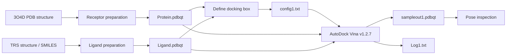
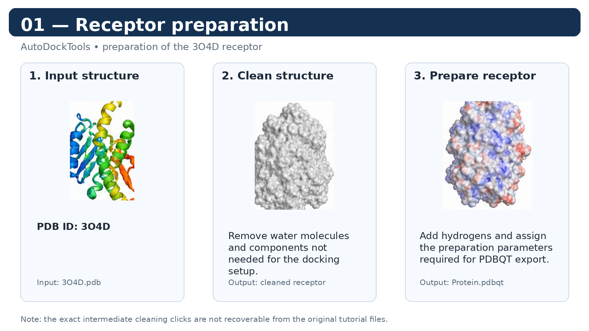
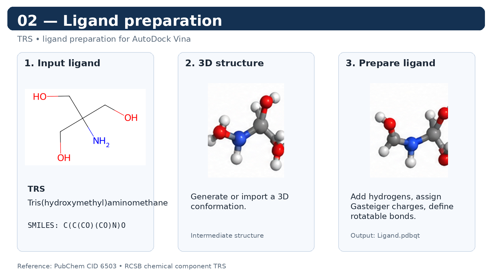
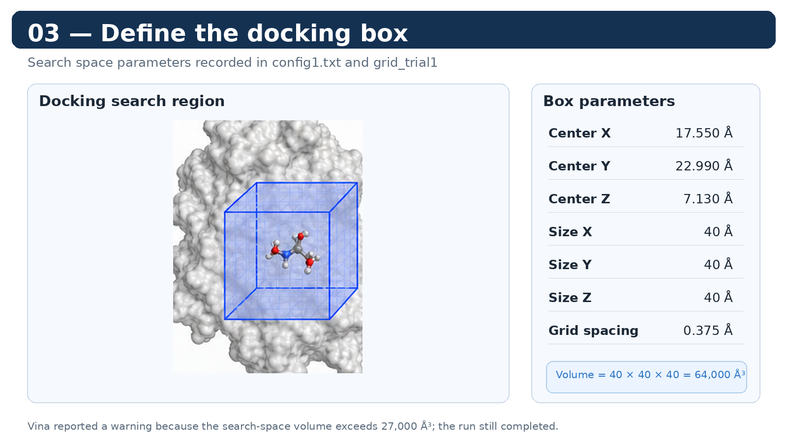
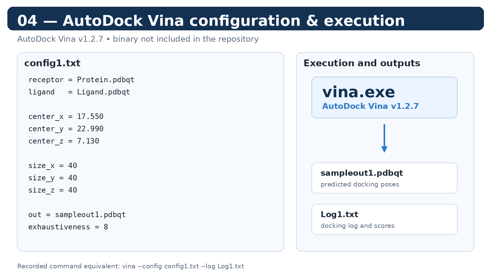
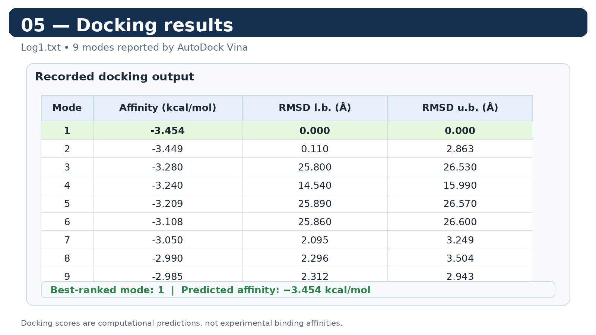
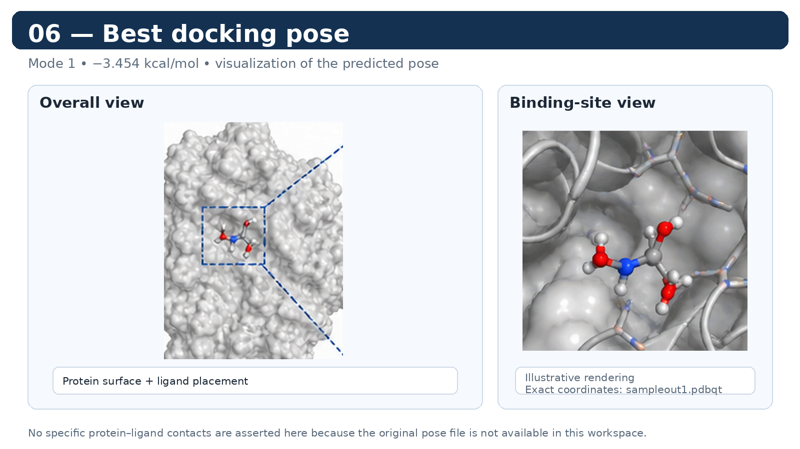

# Molecular Docking with AutoDock Vina

## Overview

This repository documents a practical **protein–ligand molecular docking** workflow using AutoDockTools and AutoDock Vina.

The project was developed as an introductory exercise in structural bioinformatics and molecular docking. It covers receptor and ligand preparation, definition of the docking search space, configuration of AutoDock Vina, docking execution, and inspection of the predicted poses.

> **Project status:** Educational docking workflow / reproducibility record.

The original tutorial used to perform this exercise is no longer available. This README therefore reconstructs the workflow from the files produced during the analysis (`PDB/PDBQT` structures, configuration files, grid parameters, and docking log).

---

## 1. System used in the example

### Receptor: PDB ID 3O4D

The starting protein structure was **3O4D**, *Crystal structure of Symfoil-4P: de novo designed beta-trefoil architecture with symmetric primary structure*.

According to the RCSB Protein Data Bank, 3O4D is a de novo designed protein determined by X-ray crystallography at **1.65 Å resolution**. The structure contains one protein chain and includes the chemical components TRS and sulfate.

Source:

- [RCSB PDB – 3O4D](https://www.rcsb.org/structure/3O4D)
- PDB DOI: https://doi.org/10.2210/pdb3O4D/pdb

### Ligand: TRS

The ligand used in the docking workflow is **TRS**, corresponding to **2-amino-2-hydroxymethyl-propane-1,3-diol**, also known as **tris(hydroxymethyl)aminomethane (TRIS)**.

RCSB PDB lists TRS as a non-polymer chemical component and gives the synonym **TRIS BUFFER**.

The exact database originally used to obtain the ligand SMILES is not recorded. For reproducibility, the compound can be referenced through:

- [RCSB PDB – TRS Chemical Component](https://www2.rcsb.org/ligand/TRS)
- [PubChem – Tris(hydroxymethyl)aminomethane, CID 6503](https://pubchem.ncbi.nlm.nih.gov/compound/6503)

PubChem provides the SMILES:

```text
C(C(CO)(CO)N)O
```

The PDB chemical component record also provides charged SMILES representations. The exact protonation state used in the original `Ligand.pdbqt` should therefore be considered part of the original preparation rather than inferred from the database entry alone.

> **Important:** TRS is catalogued as TRIS BUFFER. In the 3O4D crystallization experiment, the crystallization solution also contained 0.1 M Tris at pH 7.0. Therefore, this repository should be viewed as a docking/practical exercise rather than a study of a biologically validated drug–target interaction.

---

## 2. Software

### AutoDockTools

AutoDockTools (ADT) was used for receptor and ligand preparation and for working with docking-related parameters.

Typical preparation steps in the classic AutoDockTools workflow include:

- removing unnecessary crystallographic waters and other unwanted molecules;
- adding hydrogens;
- assigning partial charges;
- assigning AutoDock atom types;
- defining ligand rotatable bonds;
- saving the prepared structures in PDBQT format;
- defining and visualizing the docking search region.

For the receptor, the classic AutoDockTools workflow commonly uses **Kollman-type charges**. For the ligand, **Gasteiger charges** are typically assigned before exporting the PDBQT structure.

> The original tutorial is not available, so the exact sequence of intermediate clicks/settings used during preparation cannot be independently verified from the remaining files. The prepared PDBQT files are the reproducibility record of the final receptor and ligand states used for docking.

### AutoDock Vina

The docking calculation was performed with **AutoDock Vina v1.2.7**.

Vina uses the prepared receptor and ligand PDBQT files together with the defined search space to perform the docking search and generate predicted ligand poses and docking scores. With the Vina scoring function, the required grid is calculated internally during the docking run rather than requiring a separate set of precomputed AutoGrid4 affinity maps.

Official resources:

- [AutoDock Vina – GitHub](https://github.com/ccsb-scripps/AutoDock-Vina)
- [AutoDock Vina – Documentation](https://autodock-vina.readthedocs.io/)
- [AutoDock Vina – Releases](https://github.com/ccsb-scripps/AutoDock-Vina/releases)
- [AutoDock Vina v1.2.7 – Release tag](https://github.com/ccsb-scripps/AutoDock-Vina/releases/tag/v1.2.7)

---

## 3. Workflow



---

## 4. Receptor preparation

The starting structure was the 3O4D PDB entry.

A typical preparation workflow for docking is:

### 4.1 Load the PDB structure

Open the downloaded `3O4D.pdb` structure in AutoDockTools or another compatible molecular visualization/preparation program.

### 4.2 Clean the receptor

Molecules that are not intended to participate in the docking calculation may need to be removed.

For a basic protein–ligand docking setup, this normally includes:

- crystallographic water molecules;
- unrelated ligands;
- solvent molecules;
- other heteroatoms that are not part of the intended receptor model.

The exact cleaning performed in the original tutorial is not fully recoverable from the remaining files, so this README does not claim a specific list of deleted molecules.

### 4.3 Add hydrogens

Hydrogens are added to create a receptor representation suitable for docking.

Particular attention should be given to **polar hydrogens**, since hydrogen-bonding interactions are important for the docking model.

### 4.4 Assign partial charges and atom types

In the classic AutoDockTools receptor-preparation workflow, the receptor is assigned:

- Kollman partial charges
- AutoDock atom types

The prepared receptor is then saved as:

```text
Protein.pdbqt
```

---

## 5. Ligand preparation

The ligand was TRS.

A typical AutoDockTools ligand-preparation workflow is:

### 5.1 Obtain the ligand structure

TRS can be obtained from a public chemical database using its molecular identifiers or SMILES.

For this project, the original source used for the SMILES is not recorded. For current reproducibility, the RCSB TRS chemical-component record and PubChem CID 6503 are provided as public references.

### 5.2 Generate or import the 3D structure

A SMILES string represents molecular connectivity rather than a complete experimentally determined 3D conformation. A 3D structure therefore needs to be generated or imported before docking preparation.

### 5.3 Add hydrogens and assign charges

The ligand is prepared by adding hydrogens and assigning partial charges.

The classic AutoDockTools workflow commonly uses **Gasteiger charges** for ligands.

### 5.4 Define rotatable bonds

Rotatable bonds are assigned so that Vina can explore ligand conformational changes during docking.

### 5.5 Save the prepared ligand

The final ligand used in the docking calculation was:

```text
Ligand.pdbqt
```

---

## 6. Docking search space

The docking search space was defined around the following center:

| Parameter | Value |
|---|---:|
| Center X | 17.550 Å |
| Center Y | 22.990 Å |
| Center Z | 7.130 Å |
| Size X | 40 Å |
| Size Y | 40 Å |
| Size Z | 40 Å |
| Grid spacing | 0.375 Å |

The search box volume was:

```text
40 × 40 × 40 = 64,000 ų
```

AutoDock Vina issued the following warning:

```text
WARNING: Search space volume is greater than 27000 Angstrom^3
```

This does not mean that the docking failed. It indicates that the selected search space is relatively large and may require more computational effort to explore efficiently.

The parameters above are independently consistent across:

- `config1.txt`
- `grid_trial1`
- `Log1.txt`

### `grid_trial1`

The file contains:

```text
Protein
spacing    0.375
npts       40 40 40
center    17.550 22.990  7.130
```

In this repository it is best treated as an **auxiliary record of the search-space parameters**.

Because the docking used:

```text
Scoring function : vina
```

and the log states:

```text
Computing Vina grid ... done.
```

`grid_trial1` should not be presented as a set of precomputed AutoGrid4 affinity maps.

---

## 7. Vina configuration

The docking configuration was:

```text
receptor = Protein.pdbqt
ligand = Ligand.pdbqt

center_x = 17.550
center_y = 22.990
center_z = 7.130

size_x = 40
size_y = 40
size_z = 40

out = sampleout1.pdbqt
exhaustiveness = 8
```

The configuration file is preserved in:

```text
config1.txt
```

---

## 8. Docking with AutoDock Vina

The docking was performed using the **Vina scoring function** with:

```text
Exhaustiveness = 8
CPU = 0
Verbosity = 1
```

A command equivalent to the recorded configuration is:

```bash
vina --config config1.txt --log Log1.txt
```

On Windows, the executable can be called as:

```bash
vina.exe --config config1.txt --log Log1.txt
```

The important input files for the docking calculation are:

```text
Protein.pdbqt
Ligand.pdbqt
config1.txt
```

The output specified in the configuration is:

```text
sampleout1.pdbqt
```

and the docking log is:

```text
Log1.txt
```

---

## 9. Docking output

The configuration specifies:

```text
out = sampleout1.pdbqt
```

Therefore, `sampleout1.pdbqt` is the principal docking output and contains the predicted ligand poses generated by Vina.

`Log1.txt` records the docking parameters and the predicted affinities for each mode.

The docking generated **9 poses/modes**.

### Recorded affinities

| Mode | Affinity (kcal/mol) | RMSD l.b. (Å) | RMSD u.b. (Å) |
|---:|---:|---:|---:|
| 1 | **-3.454** | 0 | 0 |
| 2 | -3.449 | 0.1101 | 2.863 |
| 3 | -3.280 | 25.80 | 26.53 |
| 4 | -3.240 | 14.54 | 15.99 |
| 5 | -3.209 | 25.89 | 26.57 |
| 6 | -3.108 | 25.86 | 26.60 |
| 7 | -3.050 | 2.095 | 3.249 |
| 8 | -2.990 | 2.296 | 3.504 |
| 9 | -2.985 | 2.312 | 2.943 |

The best-ranked pose had a predicted affinity of:

```text
-3.454 kcal/mol
```

The second-ranked pose was very similar in predicted affinity:

```text
-3.449 kcal/mol
```

> These values are docking scores generated by a computational model. They should not be interpreted as experimental binding affinities.

---

## 10. Files in the repository

```text
Molecular-Docking-AutoDock-Vina/
│
├── README.md
│
├── images/
│   ├── 01_receptor_preparation.png
│   ├── 02_ligand_preparation.png
│   ├── 03_docking_box.png
│   ├── 04_vina_configuration.png
│   ├── 05_docking_results.png
│   └── 06_best_pose.png
│
├── 3O4D.pdb
├── Protein.pdbqt
│
├── TRS.pdb
├── Ligand.pdbqt
│
├── config1.txt
├── grid_trial1
├── Log1.txt
└── sampleout1.pdbqt
```

File roles:

| File | Description |
|---|---|
| `3O4D.pdb` | Original receptor structure downloaded from the PDB |
| `Protein.pdbqt` | Prepared receptor used by Vina |
| `TRS.pdb` | Ligand structure used for preparation |
| `Ligand.pdbqt` | Prepared ligand used by Vina |
| `config1.txt` | Vina docking configuration |
| `grid_trial1` | Auxiliary record of the search-space parameters |
| `Log1.txt` | Docking log and predicted scores |
| `sampleout1.pdbqt` | Docking poses generated by Vina |
| `images/` | Reference figures illustrating the workflow |

---

## 11. Images and visual documentation

The original tutorial screenshots are no longer available. The figures below are therefore **reference diagrams created for this repository to document and explain the workflow**; they should not be interpreted as original screenshots from the tutorial.

### 11.1 Receptor preparation



**Path:** `images/01_receptor_preparation.png`

This figure summarizes the receptor-preparation stage, from the 3O4D input structure to the prepared `Protein.pdbqt` file.

### 11.2 Ligand preparation



**Path:** `images/02_ligand_preparation.png`

This figure summarizes the preparation of TRS and the generation of `Ligand.pdbqt`.

### 11.3 Docking box definition



**Path:** `images/03_docking_box.png`

The figure shows the search-space dimensions and center recorded in `config1.txt`.

### 11.4 AutoDock Vina configuration and execution



**Path:** `images/04_vina_configuration.png`

The figure documents the `config1.txt` parameters, the use of **AutoDock Vina v1.2.7**, and the relationship between the docking executable and the output files.

### 11.5 Docking results



**Path:** `images/05_docking_results.png`

This figure summarizes the nine docking modes recorded in `Log1.txt`, including the best-ranked score of `-3.454 kcal/mol`.

### 11.6 Best docking pose



**Path:** `images/06_best_pose.png`

This figure provides a visual reference for inspecting the predicted best pose. It is not intended to replace a structure-based analysis of the actual coordinates in `sampleout1.pdbqt`.

---

## 12. AutoDock Vina executables

The project originally contained two Windows executables:

```text
vina.exe
vina_split.exe
```

These executables were kept locally during the original exercise. They have since been **removed from this GitHub repository**.

### 12.1 `vina.exe`

`vina.exe` is the command-line executable used to run the AutoDock Vina docking calculation. It takes the prepared receptor and ligand structures, the docking configuration, and the defined search space as inputs, and produces predicted docking poses and scores.

For this project, the recorded docking workflow used:

```text
AutoDock Vina v1.2.7
```

The corresponding official release is:

[AutoDock Vina v1.2.7](https://github.com/ccsb-scripps/AutoDock-Vina/releases/tag/v1.2.7)

A command equivalent to the documented run is:

```bash
vina.exe --config config1.txt --log Log1.txt
```

### 12.2 `vina_split.exe`

`vina_split.exe` is a companion command-line utility distributed with AutoDock Vina. It can be used to separate a multi-model PDBQT output file into individual pose files.

The presence of `vina_split.exe` in the original project directory does **not** by itself establish that it was used in this particular docking run. No specific use of `vina_split.exe` is documented in the remaining project files.

### 12.3 Why the executables are not included

The repository does not need to redistribute the Vina binaries. Keeping the executables outside the repository:

- avoids storing third-party binary files in the project;
- keeps the repository focused on the workflow, inputs, configuration, and results;
- allows users to obtain the appropriate executable for their operating system from the official source;
- preserves software provenance through the specific version and release tag.

Official resources:

- [AutoDock Vina GitHub repository](https://github.com/ccsb-scripps/AutoDock-Vina)
- [Official releases](https://github.com/ccsb-scripps/AutoDock-Vina/releases)
- [v1.2.7 release tag](https://github.com/ccsb-scripps/AutoDock-Vina/releases/tag/v1.2.7)
- [Installation and pre-compiled executables](https://github.com/ccsb-scripps/AutoDock-Vina/blob/develop/docs/source/installation.rst)

AutoDock Vina is distributed under the **Apache License 2.0**.

> **Reproducibility note:** The version used for this project is recorded as **v1.2.7**. The executable itself is intentionally not stored in this repository.

---

## 13. Limitations

This project has several limitations:

- The original tutorial used to perform the exercise is no longer available.
- The exact intermediate AutoDockTools preparation steps cannot be completely reconstructed from the remaining files.
- The docking search space was relatively large (`64,000 ų`), and Vina explicitly warned about this.
- The ligand is TRS/TRIS buffer rather than a validated therapeutic compound.
- Only one docking setup is documented.
- The results are computational predictions and were not experimentally validated.
- The reference figures in `images/` are explanatory diagrams rather than original screenshots from the missing tutorial.

For these reasons, this repository should be considered a **learning and reproducibility exercise in molecular docking**, rather than a validated protein–ligand binding study.

---

## 14. References

### Protein structure

Lee, J., & Blaber, M. (2011). Experimental support for the evolution of symmetric protein architecture from a simple peptide motif. *Proceedings of the National Academy of Sciences, 108*(1), 126–130. https://doi.org/10.1073/pnas.1015032108

PDB entry: **3O4D**  
https://www.rcsb.org/structure/3O4D

### Ligand

TRS / 2-amino-2-hydroxymethyl-propane-1,3-diol / tris(hydroxymethyl)aminomethane.

Chemical component ID: **TRS**  
https://www2.rcsb.org/ligand/TRS

PubChem CID: **6503**  
https://pubchem.ncbi.nlm.nih.gov/compound/6503

### Docking software

Eberhardt, J., Santos-Martins, D., Tillack, A. F., & Forli, S. (2021). AutoDock Vina 1.2.0: New docking methods, expanded force field, and Python bindings. *Journal of Chemical Information and Modeling, 61*(8), 3891–3898. https://doi.org/10.1021/acs.jcim.1c00203

Trott, O., & Olson, A. J. (2010). AutoDock Vina: Improving the speed and accuracy of docking with a new scoring function, efficient optimization, and multithreading. *Journal of Computational Chemistry, 31*(2), 455–461. https://doi.org/10.1002/jcc.21334

### Software documentation

- [AutoDock Vina official documentation](https://autodock-vina.readthedocs.io/)
- [AutoDock Vina official GitHub repository](https://github.com/ccsb-scripps/AutoDock-Vina)
- [AutoDock Vina official releases](https://github.com/ccsb-scripps/AutoDock-Vina/releases)

---

## License

This repository contains an educational molecular docking workflow and project files prepared by the author.

AutoDock Vina is a third-party software project distributed under the **Apache License 2.0**. Its source code and official releases should be obtained from the upstream project.
